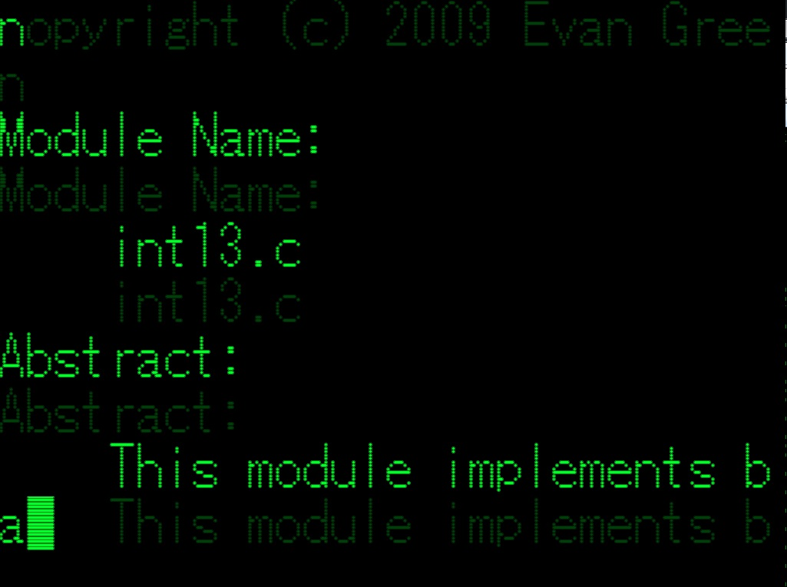

# Phosphor 2
This project is a Windows screensaver based on the original Phosphor xscreensaver by Jamie Zawinski.

### Installation Instructions
Installation is easy. Simply download the binary from the Downloads page, right click it, and select Install. Right click and select Test if you'd like to see it without installing it.

### What is this?
Phosphor2 is a screensaver that creates the appearance of the old "Green Screen" terminals. It will print out the contents of a list of files or directories provided by you, enumerated randomly, or print out the source code for the screensaver itself by default.

### Configuration
Configuration should be fairly straightforward, and includes options for changing the foreground color, background color, cursor blink rate, text rate, text size, and text fade rate. The only slightly tricky box is the Files box, and it's not even that hard. The files box takes a semicolon-delimited list of files, potentially with wildcards. Wildcards are recursive meaning that if you specify a wildcard, it includes the file pattern in that directory and any subdirectories.

Let's do an example. The following prints out any files that end in .c or .h from the directory `c:\\src` or any of its child directories, as well as one individual called Makefile. Files are chosen at random from the list. `c:\\src\\*.c;c:\\src\\*.h;c:\\src\\Makefile`

If you specify nothing or no valid files, the source files of the screensaver itself will be printed to the screen to keep you occupied. Feel free to point out bugs!

### License
GPLv3
